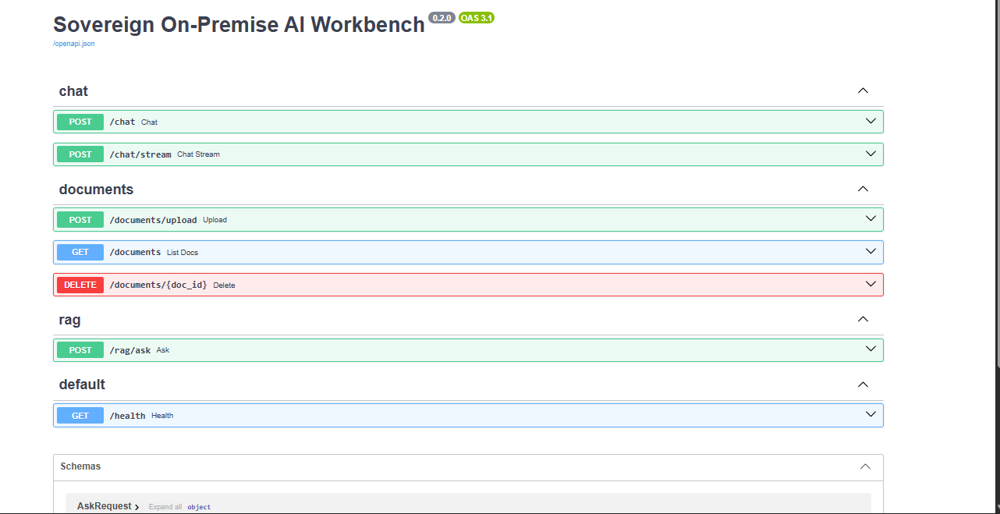
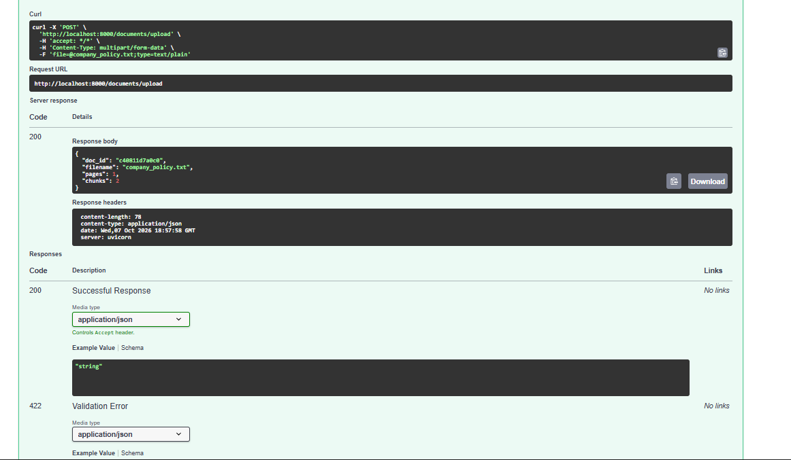
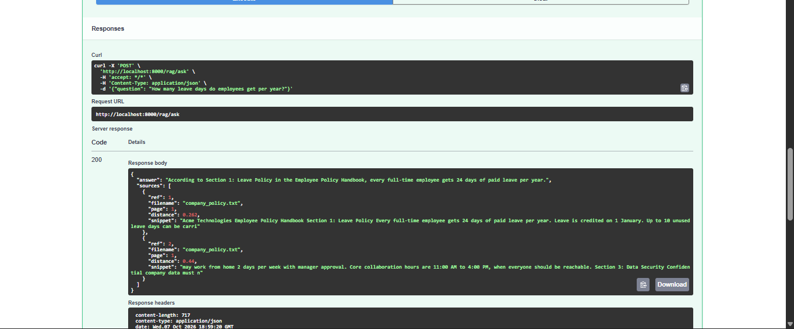
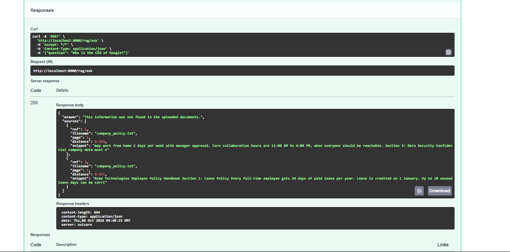

# Sovereign On-Premise AI Workbench

A private AI assistant that runs **entirely on your own machine**. Upload internal documents, ask questions, and get answers with source citations, without any data ever leaving the computer. No cloud APIs, no internet needed after setup.

> Built as a personal project, inspired by the Smart India Hackathon 2026 problem statement SIH260117 (Sovereign On-Premise Agentic AI Workbench).

## Why this exists

Organizations such as banks, hospitals, police departments and government offices cannot upload sensitive documents to public AI services. This project shows how to get the same kind of document Q&A with a **local LLM + RAG pipeline** that stays inside the organization.

## Features

- **Fully offline:** local LLM and local embeddings via [Ollama](https://ollama.com)
- **Document Q&A (RAG):** upload PDF, DOCX, TXT or MD files and ask questions about them
- **Source citations:** every answer comes with the file name, page number, snippet and similarity distance
- **Hallucination control:** if the answer is not in the documents, the assistant says so instead of guessing
- **Built from scratch:** chunking, embedding, retrieval and prompting are written in plain Python (no LangChain), so every step is visible and easy to follow
- **REST API** with interactive Swagger docs

## Architecture

```
Upload:  file -> text parser -> chunks -> embedding model -> ChromaDB (disk)

Ask:     question -> embedding -> top-k similar chunks -> prompt (+ context) -> local LLM -> answer + sources
```

| Layer | Technology |
|---|---|
| API | FastAPI (Python) |
| LLM | Ollama, `llama3.2:3b` (swappable via `.env`) |
| Embeddings | Ollama, `nomic-embed-text` |
| Vector database | ChromaDB (persistent, cosine similarity) |
| Parsing | pypdf, python-docx |

## How the RAG pipeline works

1. **Parse:** extract text page by page from the uploaded file.
2. **Chunk:** split text into ~800 character pieces with 150 characters of overlap, preferring sentence boundaries.
3. **Embed:** convert each chunk to a vector with `nomic-embed-text`.
4. **Store:** save chunks, vectors and metadata (file, page) in ChromaDB.
5. **Retrieve:** embed the question and fetch the 4 closest chunks.
6. **Generate:** give those chunks to the LLM with the instruction to answer only from them and cite `[1]`, `[2]`. Temperature is kept low (0.2) for factual answers.

## Quick start

**Requirements:** Python 3.10+, [Ollama](https://ollama.com), about 8 GB of free RAM.

```bash
# 1. Download the models (one time, needs internet)
ollama pull llama3.2:3b
ollama pull nomic-embed-text

# 2. Set up the project
git clone https://github.com/<your-username>/sovereign-ai-workbench.git
cd sovereign-ai-workbench
python -m venv .venv
.venv\Scripts\activate          # Windows
# source .venv/bin/activate     # Linux / macOS
pip install -r requirements.txt
copy .env.example .env          # Linux / macOS: cp .env.example .env

# 3. Run
uvicorn app.main:app --reload
```

Open **http://localhost:8000/docs** for the interactive API.

## Try it

1. `POST /documents/upload`: upload `samples/company_policy.txt`
2. `POST /rag/ask`:
   ```json
   {"question": "How many leave days do employees get per year?"}
   ```
3. The response contains the answer and the sources it used.
4. Ask something that is not in the document (for example "Who is the CEO of Google?") and the assistant replies that the information was not found.

## Screenshots

| API overview | Document upload |
|---|---|
|  |  |

| Answer with sources | Not found in documents |
|---|---|
|  |  |

## Project structure

```
app/
├── main.py            # FastAPI app and /health
├── config.py          # settings from .env
├── llm.py             # Ollama chat client (normal + streaming)
├── embeddings.py      # Ollama embedding client
├── parsers.py         # PDF / DOCX / TXT text extraction
├── chunking.py        # overlapping text chunker
├── vectorstore.py     # ChromaDB wrapper
└── routers/
    ├── chat.py        # /chat, /chat/stream
    ├── documents.py   # /documents upload, list, delete
    └── rag.py         # /rag/ask
samples/               # demo document
```

## Roadmap

- [x] Phase 1: local LLM chat API
- [x] Phase 2: RAG with citations and hallucination control
- [ ] Phase 3: tool-using AI agents (document search, summarizer, SQL query)
- [ ] Phase 4: authentication, role-based access, document-level permissions, audit logs, PII masking
- [ ] Phase 5: web UI, Docker Compose packaging, demo video

## Known limitations

- Scanned PDFs (images) are not supported yet because OCR is not included
- Small local models (3B parameters) are weaker in Hindi than in English; use a larger model such as `qwen2.5:7b` for better multilingual answers
- No authentication yet (planned in Phase 4), so run it only on a trusted machine

## License

MIT
